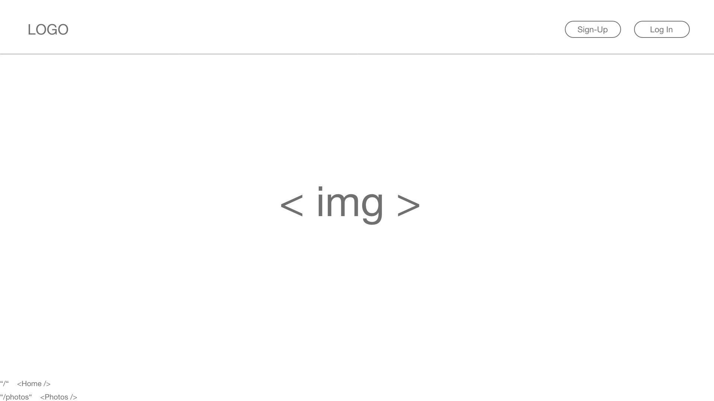
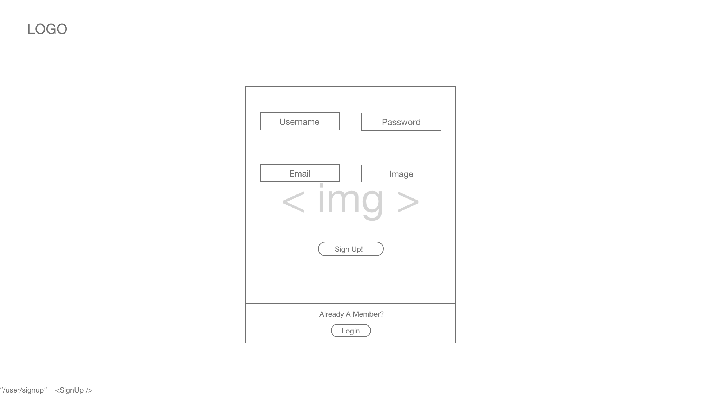
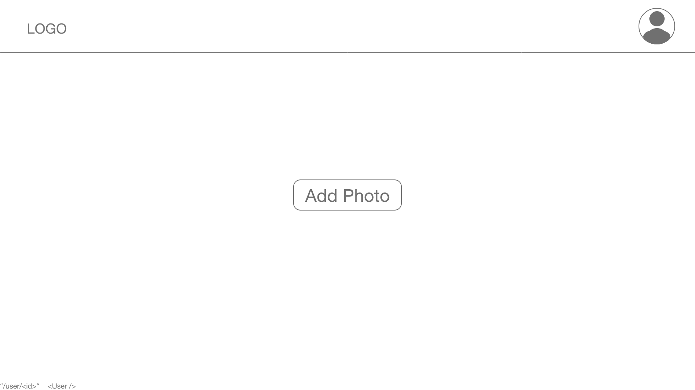
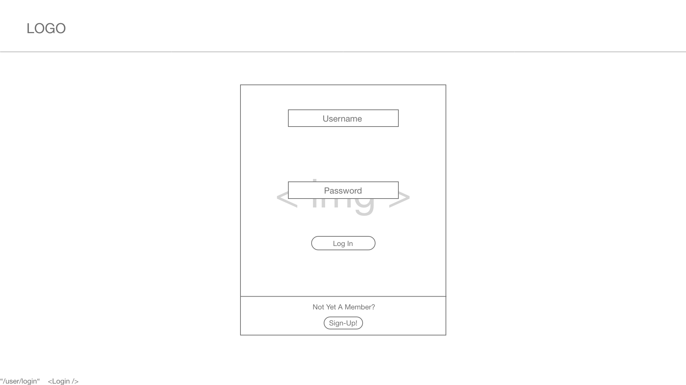
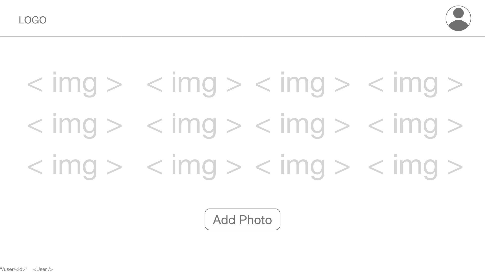
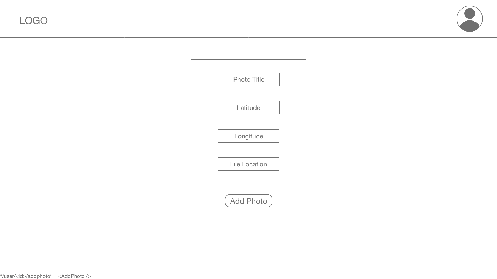
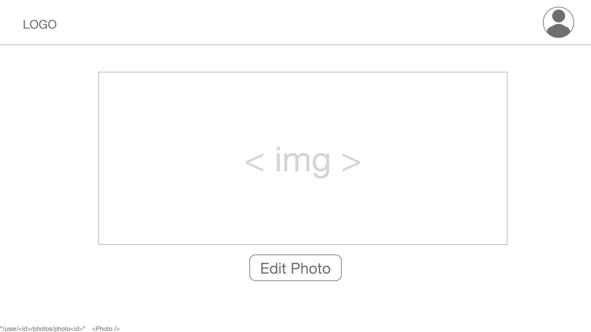
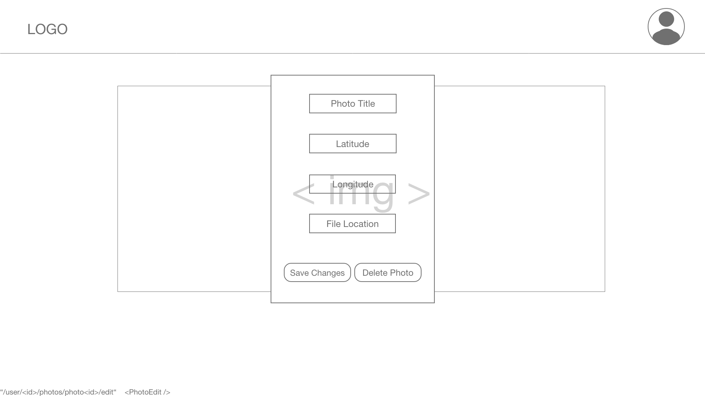
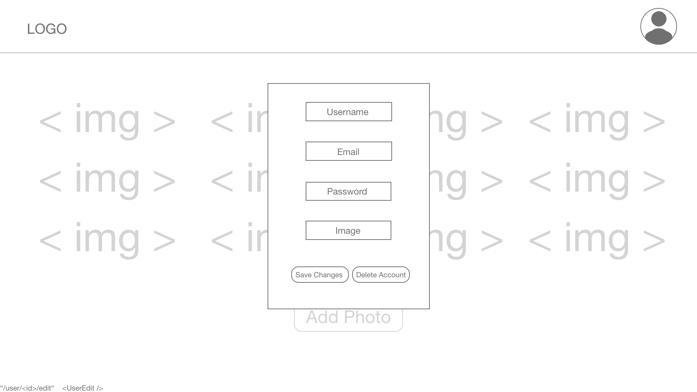

# On The Line

### Intro
_______________________________________________________________________________________________________________________

On The Line is a photo sharing web app that allows users to upload and edit their favorite photos!

### Intended User Flow
_______________________________________________________________________________________________________________________
New users are prompted at the landing page to sign up and create a new account (returning users are able to login directly from the landing page as well).  After signing up or loggin in, the user is redirected to their user page which gives them the opportunity to post a photo and edit their account details.  Each new photo posted will appear on the users's page and can be clicked through to update or delete it.

### Initial Wireframe
_______________________________________________________________________________________________________________________
### Landing Page

### Sign-Up

### User-Show After Sign-up

### Login

### User-Show After Login

### Add A Photo

### Photo Show

### Photo Edit

### User Edit

### Technologies Used
_______________________________________________________________________________________________________________________

* HTML
* JavaScript
* CSS
* React
* Flask
* Heroku
* Git
* GitHub

### Visit the site!
_______________________________________________________________________________________________________________________
[Screenshot] 

Visit the project page <a href="https://fierce-brook-99190-react.herokuapp.com/">HERE</a>

### Next Steps
_______________________________________________________________________________________________________________________

* Implement saved dog list for potential adopters
* Implement search function
